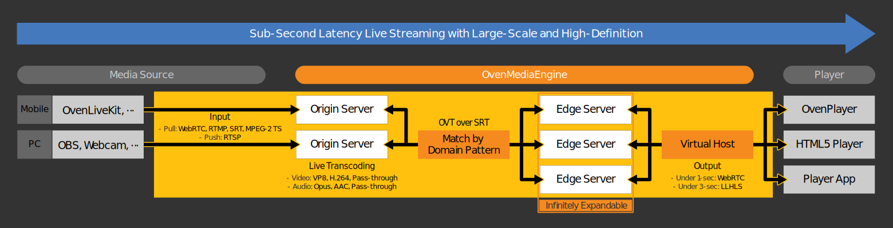
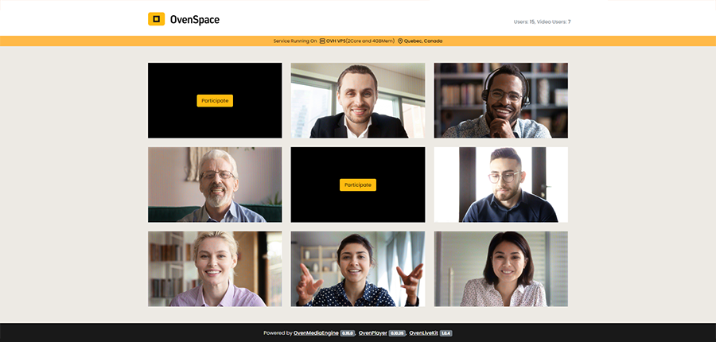

# OvenMediaEngine

## What is OvenMediaEngine?


OvenMediaEngine (OME) is a Sub-Second Latency Streaming Server that can stream Large-scale and High-definition live streams over Low Latency HLS (LLHLS) and WebRTC to hundreds of thousands of viewers.

OME can ingest live streams over WebRTC, SRT, RTMP, RTSP, and MPEG2-TS protocols, encode them to ABR with the embedded live transcoder, and stream them to viewers over LLHLS and WebRTC.

With OvenMediaEngine, you can build your powerful and sub-second latency media service very easily.

## Demo https://space.ovenplayer.com/


OvenSpace is a sub-second latency streaming demo service using [OvenMediaEngine](https://github.com/AirenSoft/OvenMediaEngine), [OvenPlayer](https://github.com/AirenSoft/OvenPlayer) and [OvenLiveKit](https://github.com/AirenSoft/OvenLiveKit-Web). You can experience OvenMediaEngine in the **[OvenSpace Demo](https://space.ovenplayer.com/)** and see examples of applying in [OvenSpace Repository](https://github.com/AirenSoft/OvenSpace).

## Features
* Ingest
  * Push: WebRTC, WHIP(Simulcast), SRT, RTMP, MPEG-2 TS
  * Pull: RTSP
  * Scheduled Channel (Pre-recorded Live)
  * Multiplex Channel (Duplicate stream / Mux tracks)
* Adaptive Bitrate Streaming (ABR) for LLHLS and WebRTC
* Low Latency Streaming using LLHLS
  * DVR (Live Rewind)
  * Dump for VoD
  * ID3v2 timed metadata
  * DRM (Widevine, Fairplay)
* Sub-Second Latency Streaming using WebRTC
  * WebRTC over TCP (With Embedded TURN Server)
  * Embedded WebRTC Signalling Server (WebSocket based)
  * Retransmission with NACK
  * ULPFEC (Uneven Level Protection Forward Error Correction)
    * <i>VP8, H.264, H.265</i>
  * In-band FEC (Forward Error Correction)
    * <i>Opus</i>
* Legacy HLS (HLS version 3)
  * MPEG-2 TS Container
  * Audio/Video Muxed
  * DVR
* Sub-Second Latency Streaming using SRT
  * Secure Reliable Transport
  * MPEG-2 TS Container
  * Audio/Video Muxed
* Embedded Live Transcoder
  * Video: VP8, H.264, H.265(Hardware only), Pass-through
  * Audio: Opus, AAC, Pass-through
* Clustering (Origin-Edge Structure)
* Monitoring
* Access Control
  * Admission Webhooks
  * Signed Policy
* File Recording
* Push Publishing using SRT, RTMP and MPEG2-TS (Re-streaming)
* Thumbnail
* REST API

## Supported Platforms
We have tested OvenMediaEngine on the platforms listed below.
Although we have tested OvenMediaEngine on the platforms listed below, it may work with other Linux packages as well:

* [Docker](https://hub.docker.com/r/airensoft/ovenmediaengine)
* Ubuntu 18+
* Rocky Linux 9+
* AlmaLinux 9+
* Fedora 28+

## Quick Start

* [Quick Start Guide](https://airensoft.gitbook.io/ovenmediaengine/quick-start)
* [Manual](https://airensoft.gitbook.io/ovenmediaengine/)

### Docker
```bash
docker run --name ome -d -e OME_HOST_IP=Your.HOST.IP.Address \
-p 1935:1935 -p 9999:9999/udp -p 9000:9000 -p 3333:3333 -p 3478:3478 -p 10000-10009:10000-10009/udp \
airensoft/ovenmediaengine:latest
```

You can also store the configuration files on your host:

```bash
docker run --name ome -d -e OME_HOST_IP=Your.HOST.IP.Address \
-p 1935:1935 -p 9999:9999/udp -p 9000:9000 -p 3333:3333 -p 3478:3478 -p 10000-10009:10000-10009/udp \
-v ome-origin-conf:/opt/ovenmediaengine/bin/origin_conf \
-v ome-edge-conf:/opt/ovenmediaengine/bin/edge_conf \
airensoft/ovenmediaengine:latest
```

The configuration files are now accessible under `/var/lib/docker/volumes/<volume_name>/_data`.

Following the above example, you will find them under `/var/lib/docker/volumes/ome-origin-conf/_data` and `/var/lib/docker/volumes/ome-edge-conf/_data`.

If you want to put them in a different location, the easiest way is to create a link:
```bash
ln -s /var/lib/docker/volumes/ome-origin-conf/_data/ /my/new/path/to/ome-origin-conf \
&& ln -s /var/lib/docker/volumes/ome-edge-conf/_data/ /my/new/path/to/ome-edge-conf
```

Please read the [Getting Started](https://airensoft.gitbook.io/ovenmediaengine/getting-started) for more information.

### WebRTC Live Encoder for Testing
* https://demo.ovenplayer.com/demo_input.html

### Player for Testing
* Without TLS: http://demo.ovenplayer.com
* With TLS: https://demo.ovenplayer.com

## How to contribute
Thank you so much for being so interested in OvenMediaEngine.

We need your help to keep and develop our open-source project, and we want to tell you that you can contribute in many ways.
For more information on how to contribute, please see our [Guidelines](CONTRIBUTING.md), [Rules](CODE_OF_CONDUCT.md), and [Contribute](https://www.ovenmediaengine.com/contribute).

- [Finding Bugs](https://github.com/AirenSoft/OvenMediaEngine/blob/master/CONTRIBUTING.md#finding-bugs)
- [Reviewing Code](https://github.com/AirenSoft/OvenMediaEngine/blob/master/CONTRIBUTING.md#reviewing-code)
- [Sharing Ideas](https://github.com/AirenSoft/OvenMediaEngine/blob/master/CONTRIBUTING.md#sharing-ideas)
- [Testing](https://github.com/AirenSoft/OvenMediaEngine/blob/master/CONTRIBUTING.md#testing)
- [Improving Documentation](https://github.com/AirenSoft/OvenMediaEngine/blob/master/CONTRIBUTING.md#improving-documentation)
- [Spreading & Use Cases](https://github.com/AirenSoft/OvenMediaEngine/blob/master/CONTRIBUTING.md#spreading--use-cases)
- [Recurring Donations](https://github.com/AirenSoft/OvenMediaEngine/blob/master/CONTRIBUTING.md#recurring-donations)

We always hope that OvenMediaEngine will give you good inspiration.

## For more information
* [AirenSoft Website](https://airensoft.com) 
  * About OvenMediaEngine, OvenMediaEngine Enterprise, OvenVideo, AirenBlog and more
* [OvenMediaEngine Getting Started](https://airensoft.gitbook.io/ovenmediaengine/)
  * User guide for OvenMediaEngine Configuration, ABR, Clustering, and more
* [OvenMediaEngine Docker Hub](https://hub.docker.com/r/airensoft/ovenmediaengine)
  * Install and use OvenMeidaEngine easily using Docker
* [OvenPlayer GitHub](https://github.com/AirenSoft/OvenPlayer)
  * JavaScript-based Player with LLHLS and WebRTC
* [OvenPlayer Getting Started](https://airensoft.gitbook.io/ovenplayer)
  * User guide for OvenPlayer UI Customize, API Reference, Examples, and more
* [OvenLiveKit](https://github.com/AirenSoft/OvenLiveKit-Web)
  * JavaScript-based Live Streaming Encoder for OvenMediaEngine
* [OvenSpace Demo](https://space.ovenplayer.com/)
  * Sub-Second Latency Streaming Demo Service

## License
OvenMediaEngine is licensed under the [AGPL-3.0-only](LICENSE).
However, if you need another license, please feel free to email us at [contact@airensoft.com](mailto:contact@airensoft.com).

## About AirenSoft
AirenSoft aims to make it easier for you to build a stable broadcasting/streaming service with Sub-Second Latency.
Therefore, we will continue developing and providing the most optimized tools for smooth Sub-Second Latency Streaming.

Would you please click on each link below for details:
* ["JavaScript-based Live Streaming Encoder" **OvenLiveKit**](https://github.com/AirenSoft/OvenLiveKit-Web)
* ["Sub-Second Latency Streaming Server with LLHLS and WebRTC" **OvenMediaEngine**](https://github.com/AirenSoft/OvenMediaEngine)
* ["JavaScript-based Player with LLHLS and WebRTC" **OvenPlayer**](https://github.com/AirenSoft/OvenPlayer)
