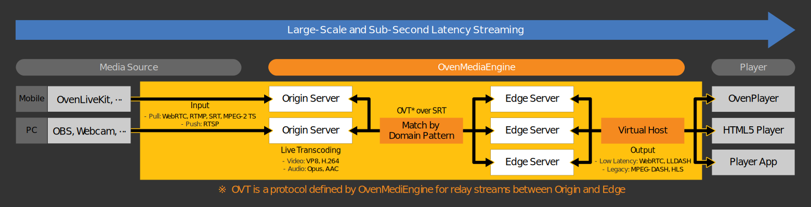

# "Sub-Second Latency Live Streaming Server with Large-Scale and High-Definition" OvenMediaEngine


## What is OvenMediaEngine?

In short, OvenMediaEngine (OME) is a <b>Sub-Second Latency Live Streaming Server</b> with <b>Large-Scale</b> and <b>High-Definition</b>.

OvenMediaEngine receives a video/audio source from encoders and cameras such as [OvenLiveKit](https://www.ovenmediaengine.com/olk), OBS, XSplit, and more to <b>WebRTC</b>, <b>RTMP</b>, <b>SRT</b>, <b>MPEG-2 TS</b> <sup><i>Beta</sup></i>, or <b>RTSP</b> <sup><i>Beta</sup></i>.  Then, OME transmits it using <b>WebRTC</b>, <b>Low Latency MPEG-DASH</b> (LLDASH), <b>MPEG-DASH</b>, and <b>HLS</b>.

Like the picture below:

OvenMediaEngine supports you can create platforms/services/systems that transmit high-definition video to hundreds-thousand viewers with sub-second latency and be scalable, depending on the number of concurrent viewers.

We also provide [OvenPlayer](https://github.com/AirenSoft/OvenPlayer), an Open-Source and JavaScript-based WebRTC Player for OvenMediaEngine.


## What is the goal of this project?

AirenSoft aims to make it easier for you to build a stable broadcasting/streaming service with Sub-Second Latency.
Therefore, we will continue developing and providing the most optimized tools for smooth Sub-Second Latency Streaming.

Would you please click on each link below for details:
* ["Live Streaming Encoder for Mobile" <b>OvenLiveKit](https://www.ovenmediaengine.com/olk)</b>
* ["Large-Scale Streaming Server with Sub-Second Latency" <b>OvenMediaEngine](https://www.ovenmediaengine.com/ome)</b>
* ["JavaScript-based WebRTC Player" <b>OvenPlayer](https://www.ovenmediaengine.com/ovenplayer)</b>


## Features

* <b>Ingest</b>
  * Push: WebRTC, RTMP, SRT, MPEG-2 TS
  * Pull: RTSP
* <b>Sub-Second Latency Streaming with WebRTC</b>
  * WebRTC over TCP (With Embedded TURN Server)
  * Embedded WebRTC Signalling Server (WebSocket based)
  * ICE (Interactive Connectivity Establishment)
  * DTLS (Datagram Transport Layer Security)
  * SRTP (Secure Real-time Transport Protocol)
  * ULPFEC (Uneven Level Protection Forward Error Correction)
    * <i>VP8, H.264</i>
  * In-band FEC (Forward Error Correction)
    * <i>Opus</i>
* <b>Low Latency HLS Streaming</b> 
* <b>Embedded Live Transcoder</b>
  * Video: VP8, H.264, Pass-through
  * Audio: Opus, AAC, Pass-through
* <b>Clustering</b> (Origin-Edge Structure)
* <b>Monitoring</b>
* <b>Access Control</b>
  * Admission Webhooks
  * Singed Policy
* File Recording
* RTMP Push Publishing (Re-streaming)
* Thumbnail
* <b>REST API<b>
* <b>Experiment</b>
  * P2P Traffic Distribution (Only WebRTC)


## Supported Platforms

We have tested OvenMediaEngine on the platforms listed below. However, we think it can work with other Linux packages as well:

* [Docker](https://hub.docker.com/r/airensoft/ovenmediaengine)
* Ubuntu 18+
* CentOS 7+
* Fedora 28+


## Getting Started

### Docker

```bash
docker run -d \
-p 1935:1935 \
-p 3333:3333 \
-p 3334:3334 \
-p 3478:3478 \
-p 9000:9000 \
-p 9999:9999/udp \
-p 4000:4000/udp \
--name ovenmediaengine \
airensoft/ovenmediaengine:latest
```

You can also store the configuration files on your host:

```bash
docker run -d \
-p 1935:1935 \
-p 3333:3333 \
-p 3334:3334 \
-p 3478:3478 \
-p 9000:9000 \
-p 9999:9999/udp \
-p 4000:4000/udp \
-v ome-origin-conf:/opt/ovenmediaengine/bin/origin_conf \
-v ome-edge-conf:/opt/ovenmediaengine/bin/edge_conf \
--name ovenmediaengine \
airensoft/ovenmediaengine:latest
```

The configuration files are now accessible under `/var/lib/docker/volumes/<volume_name>/_data`.

Following the above example, you will find them under `/var/lib/docker/volumes/ome-origin-conf/_data` and `/var/lib/docker/volumes/ome-edge-conf/_data`.

If you want to put them in a different location, the easiest way is to create a link:
```bash
ln -s /var/lib/docker/volumes/ome-origin-conf/_data/ /my/new/path/to/ome-origin-conf \
&& ln -s /var/lib/docker/volumes/ome-edge-conf/_data/ /my/new/path/to/ome-edge-conf
```

#### Other Methods

Please read the [Getting Started](https://airensoft.gitbook.io/ovenmediaengine/getting-started).


## How to contribute

Thank you so much for being so interested in OvenMediaEngine.

We need your help to keep and develop our open-source project, and we want to tell you that you can contribute in many ways. Please see our [Guidelines](CONTRIBUTING.md), [Rules](CODE_OF_CONDUCT.md), and [Contribute](https://www.ovenmediaengine.com/contribute).

- [Finding Bugs](https://github.com/AirenSoft/OvenMediaEngine/blob/master/CONTRIBUTING.md#finding-bugs)
- [Reviewing Code](https://github.com/AirenSoft/OvenMediaEngine/blob/master/CONTRIBUTING.md#reviewing-code)
- [Sharing Ideas](https://github.com/AirenSoft/OvenMediaEngine/blob/master/CONTRIBUTING.md#sharing-ideas)
- [Testing](https://github.com/AirenSoft/OvenMediaEngine/blob/master/CONTRIBUTING.md#testing)
- [Improving Documentation](https://github.com/AirenSoft/OvenMediaEngine/blob/master/CONTRIBUTING.md#improving-documentation)
- [Spreading & Use Cases](https://github.com/AirenSoft/OvenMediaEngine/blob/master/CONTRIBUTING.md#spreading--use-cases)
- [Recurring Donations](https://github.com/AirenSoft/OvenMediaEngine/blob/master/CONTRIBUTING.md#recurring-donations)

We always hope that OvenMediaEngine will give you good inspiration.


## For more information

* [OvenMediaEngine Website](https://ovenmediaengine.com) 
  * Basic Information and Benchmark about OvenMediaEngine
* [OvenMediaEngine Tutorial](https://airensoft.gitbook.io/ovenmediaengine/)
  * Getting Started, Install, and Configuration
* [OvenMediaEngine Tutorial Source](https://github.com/AirenSoft/OvenMediaEngineDocs)
  * Please contribute by making a pull request for the user guide of our open-soure project
* [OvenMediaEngine Docker Hub](https://hub.docker.com/r/airensoft/ovenmediaengine)
  * Install and use OvenMeidaEngine easily using Docker
* Test Player
  * `Without TLS`: [http://demo.ovenplayer.com](http://demo.ovenplayer.com)
  * `With TLS`: [https://demo.ovenplayer.com](https://demo.ovenplayer.com)
* [OvenPlayer Github](https://github.com/AirenSoft/OvenPlayer)
  * JavaScript-based WebRTC Player for OvenMediaEngine
* [AirenSoft Website](https://www.airensoft.com/)
  * AirenSoft's Solutions/Services, and AirenBlog (Tech Journal)


## License

OvenMediaEngine is licensed under the [AGPL-3.0-only](LICENSE).
However, if you need another license, please feel free to email us at [contact@airensoft.com](mailto:contact@airensoft.com).
