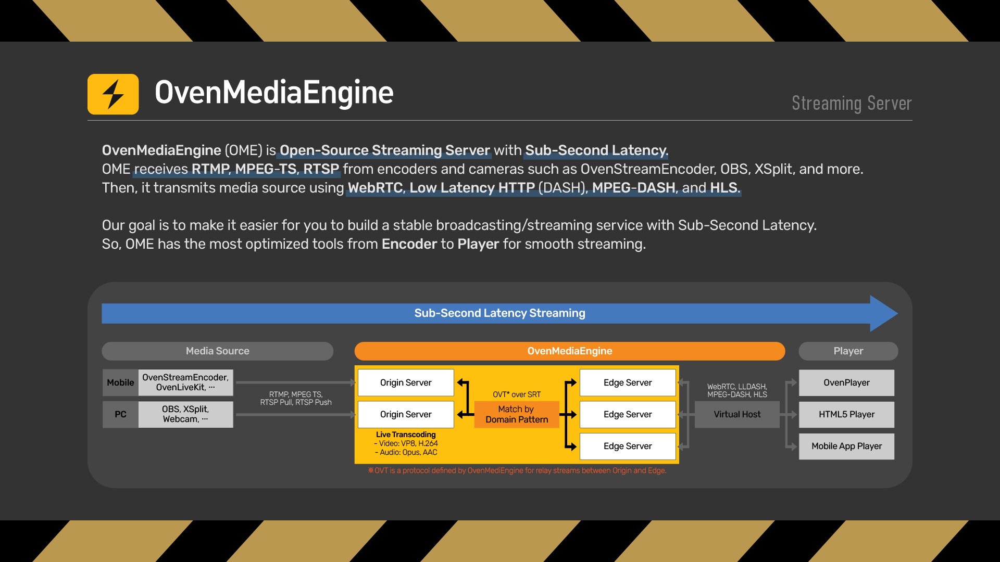
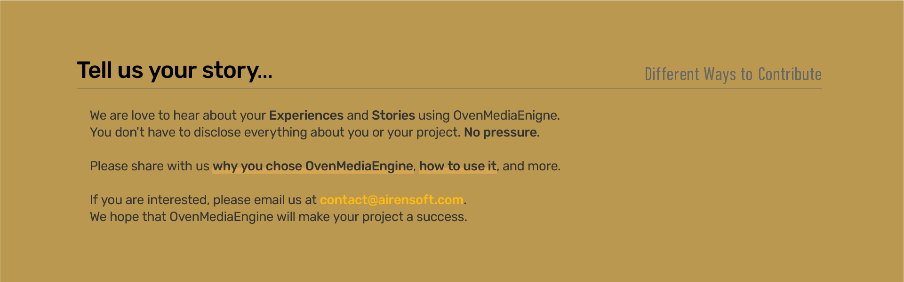

# "Sub-Second Latency Streaming Server" OvenMediaEngine

## What is OvenMediaEngine?

OvenMediaEngine (OME) is <b>Open-Source Streaming Server</b> with <b>Sub-Second Latency</b>.
OME receives <b>RTMP</b>, <b>MPEG-TS</b> (Beta), <b>RTSP</b> (Beta) from encoders and cameras such as [OvenStreamEncoder](https://www.airensoft.com/olk), OBS, XSplit, and more. And, it transmits media source using <b>WebRTC</b>, <b>Low Latency HTTP</b> (DASH), <b>MPEG-DASH</b>, and <b>HLS</b>.
We also provides [OvenPlayer](https://github.com/AirenSoft/OvenPlayer), Open-Source HTML5 Player.




## What is the goal of this project?

Our goal is to make it easier for you to build a stable broadcasting/streaming service with Sub-Second Latency.
So, our projects have the most optimized tools from Encoder to Player for smooth streaming.

Please click on each banner below for details.

[](https://www.airensoft.com/olk)
[](https://www.ovenmediaengine.com/ome)
[](https://www.ovenmediaengine.com/ovenplayer)


## Features

* RTMP Push, MPEG-2 TS Push (Beta), RTSP Pull (Beta) Input
* WebRTC sub-second streaming 
  * ICE \(Interactive Connectivity Establishment\)
  * DTLS \(Datagram Transport Layer Security\)
  * SRTP \(Secure Real-time Transport Protocol\)
  * ULPFEC \(Forward Error Correction\) with VP8, H.264
  * In-band FEC \(Forward Error Correction\) with Opus
* Low latency MPEG-DASH(Chunked CAMF) streaming
* Legacy HLS/MPEG-DASH Streaming
* Embedded Live Transcoder \(VP8, H.264, Opus, AAC, Bypass\)
* Embedded WebRTC Signalling Server \(WebSocket based\)
* Origin-Edge structure
* Monitoring
* Experiment
  * P2P Traffic Distribution (Only WebRTC)


## Supported Platforms

We have tested OME on the platforms listed below. However, we think it can work with other Linux packages as well:

* Docker (https://hub.docker.com/r/airensoft/ovenmediaengine)
* Ubuntu 18
* CentOS 7
* Fedora 28

## Getting Started

```
docker run -d \
-p 1935:1935 -p 3333:3333 -p 8080:8080 -p 9000:9000 -p 4000-4005:4000-4005/udp -p 10006-10010:10006-10010/udp \
airensoft/ovenmediaengine:latest
```
Please read [Getting Started](https://airensoft.gitbook.io/ovenmediaengine/getting-started) chapter in tutorials.


## How to Contribute

Please see our [Guidelines ](CONTRIBUTING.md)and [Rules](CODE_OF_CONDUCT.md).

And we are love to hear use cases. Please tell us your story.

[](mailto:contact@airensoft.com)


## For more information

* [OvenMediaEngine Website](https://ovenmediaengine.com) 
  * Basic Information, FAQ, and Benchmark
* [OvenMediaEngine Tutorials](https://airensoft.gitbook.io/ovenmediaengine/)
  * Getting Started, Install, and Configuration
* Test Player
  * `Without TLS` : [http://demo.ovenplayer.com](http://demo.ovenplayer.com)
  * `Based on TLS` : [https://demo.ovenplayer.com](https://demo.ovenplayer.com)
* [OvenPlayer Github](https://github.com/AirenSoft/OvenPlayer)
* [OvenPlayer Website](https://ovenplayer.com/index.html)
* [AirenSoft Website](https://www.airensoft.com/)


## License

OvenMediaEngine is under the [GPLv2 license](LICENSE).
