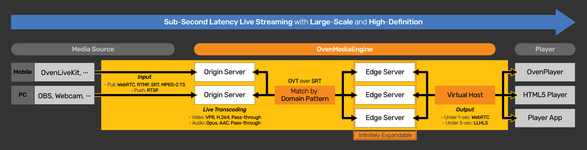

# Introduction

## What is OvenMediaEngine?

[**OvenMediaEngine**](https://github.com/AirenSoft/OvenMediaEngine) (OME) is a **Sub**-**Second Latency Live Streaming Server** with **Large**-**Scale** and **High**-**Definition**. With OME, you can create platforms/services/systems that transmit high-definition video to hundreds-thousand viewers with sub-second latency and be scalable, depending on the number of concurrent viewers.

<figure><figcaption></figcaption></figure>

OvenMediaEngine can receive a video/audio, video, or audio source from encoders and cameras such as [OvenLiveKit](https://www.ovenmediaengine.com/olk), OBS, XSplit, and more, to WebRTC, SRT, RTMP, MPEG-2 TS, and RTSP as Input. Then, OME transmits this source using **LLHLS** (Low Latency HLS) and **WebRTC** as output. Also, we provide [OvenPlayer](https://github.com/AirenSoft/OvenPlayer), an Open-Source and JavaScript-based WebRTC/LLHLS Player for OvenMediaEngine.

Our goal is to make it easier for you to build a stable broadcasting/streaming service with sub-second latency.

## Features

* **Ingest**
  * Push: WebRTC, WHIP (Simulcast), SRT, RTMP, MPEG-2 TS
  * Pull: RTSP
  * Scheduled Channel (Pre-recorded Live)
  * Multiplex Channel (Duplicate stream / Mux tracks)
* **Adaptive Bitrate Streaming (ABR) for HLS, LLHLS and WebRTC**
* **Low-Latency Streaming using LLHLS**
  * DVR (Live Rewind)
  * Dump for VoD
  * ID3v2 timed metadata
  * DRM (Widevine, Fairplay)
* **Sub-Second Latency Streaming using WebRTC**
  * WebRTC over TCP (with embedded TURN server)
  * Embedded WebRTC Signaling Server (WebSocket based)
  * Retransmission with NACK
  * ULPFEC (Uneven Level Protection Forward Error Correction)
    * _VP8, H.264_
  * In-band FEC (Forward Error Correction)
    * _Opus_
* **HLS (version 3) Streaming support for legacy devices**
  * MPEG-2 TS Container
  * Audio/Video Muxed
  * DVR (Live Rewind)
* **Sub-Second Latency Streaming using SRT**
  * Secure Reliable Transport
  * MPEG-2 TS Container
  * Audio/Video Muxed
* **Embedded Live Transcoder**
  * Video: VP8, H.264, H.265(Hardware encoder only), Pass-through
  * Audio: Opus, AAC, Pass-through
* **Clustering** (Origin-Edge Structure)
* **Monitoring**
* **Access Control**
  * AdmissionWebhooks
  * SignedPolicy
* **File Recording**
* **Push Publishing using SRT, RTMP and MPEG2-TS** (Re-streaming)
* **Thumbnail**
* **REST API**

## Supported Platforms

We have tested OvenMediaEngine on platforms, listed below. However, we think it can work with other Linux packages as well:

* Docker ([https://hub.docker.com/r/airensoft/ovenmediaengine](https://hub.docker.com/r/airensoft/ovenmediaengine))
* Ubuntu 18+
* Rocky Linux 9+
* AlmaLinux 9+
* Fedora 28+

## Getting Started

Please read [Getting Started](getting-started/) chapter in the tutorials.

## How to Contribute

Thank you so much for being so interested in OvenMediaEngine.

We need your help to keep and develop our open-source project, and we want to tell you that you can contribute in many ways. Please see our [Guidelines](../CONTRIBUTING.md), [Rules](../CODE_OF_CONDUCT.md), and [Contribute](https://www.ovenmediaengine.com/contribute).

* [Finding Bugs](../CONTRIBUTING.md#finding-bugs)
* [Reviewing Code](../CONTRIBUTING.md#reviewing-code)
* [Sharing Ideas](../CONTRIBUTING.md#sharing-ideas)
* [Testing](../CONTRIBUTING.md#testing)
* [Improving Documentation](../CONTRIBUTING.md#improving-documentation)
* [Spreading & Use Cases](../CONTRIBUTING.md#spreading--use-cases)
* [Recurring Donations](../CONTRIBUTING.md#recurring-donations)

We always hope that OvenMediaEngine will give you good inspiration.

## For more information

* [OvenMediaEngine GitHub](https://github.com/AirenSoft/OvenMediaEngine)
* [OvenMediaEngine Website](https://ovenmediaengine.com)
* [OvenMediaEngine Tutorial Source](https://github.com/AirenSoft/OvenMediaEngineDocs)
* Test Player
  * _Without TLS:_ [_http://demo.ovenplayer.com_](http://demo.ovenplayer.com)
  * _With TLS:_ [_https://demo.ovenplayer.com_](https://demo.ovenplayer.com)
* [OvenPlayer Github](https://github.com/AirenSoft/OvenPlayer)
* [AirenSoft Website](https://www.airensoft.com)

## License

OvenMediaEngine is licensed under the [AGPL-3.0-only](../LICENSE/). However, if you need another license, please feel free to email us at [contact@airensoft.com](mailto:contact@airensoft.com).
