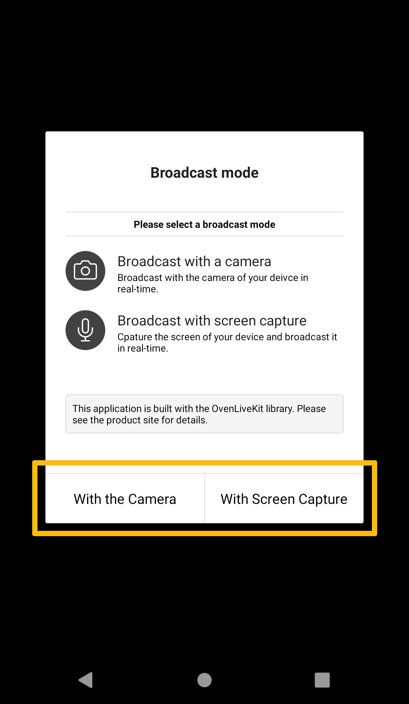
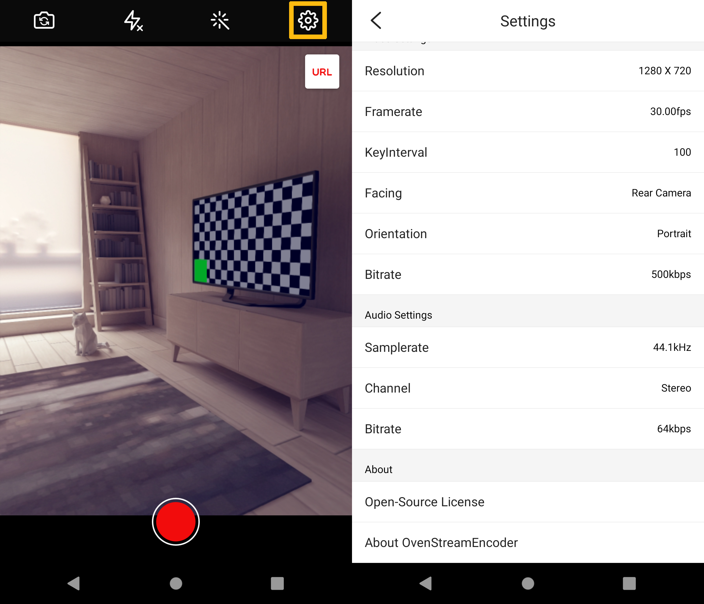
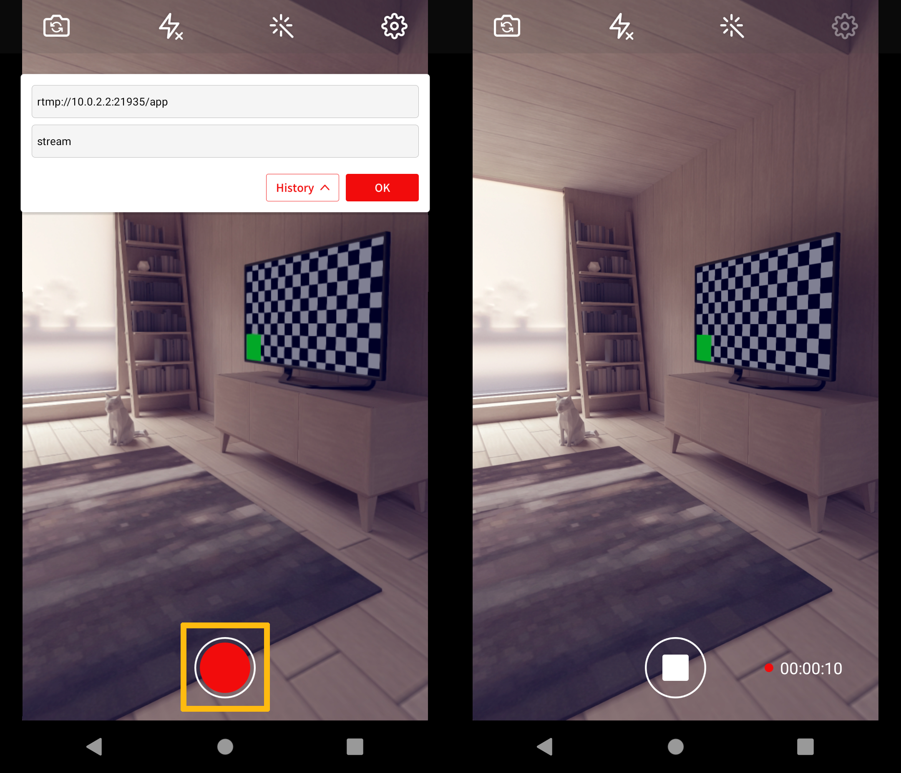

# Getting Started

## Running with Docker

OvenMediaEngine supports the Docker image from [AirenSoft's Docker Hub](https://hub.docker.com/r/airensoft/ovenmediaengine) (**airensoft/ovenmediaengine)** repository. After installing [Docker](https://www.docker.com), you can simply run the following command:

```
docker run -d \
-p 1935:1935 -p 4000:4000/udp -p 3333:3333 -p 3334:3334 -p 3478:3478 -p 9000:9000 -p 9999:9999/udp \
airensoft/ovenmediaengine:dev
```


To use TLS, you must set up a certificate. See [TLS Encryption](configuration/tls-encryption.md) for more information.


You can set the following environment variables.

### Ports

| Env                                | Default Value |
| ---------------------------------- | ------------- |
| OME\_ORIGIN\_PORT                  | 9000          |
| OME\_RTMP\_PROV\_PORT              | 1935          |
| OME\_SRT\_PROV\_PORT               | 9999/udp      |
| OME\_MPEGTS\_PROV\_PORT            | 4000/udp      |
| OME\_LLHLS\_STREAM\_PORT           | 3333          |
| OME\_LLHLS\_STREAM\_TLS\_PORT      | 3334          |
| OME\_WEBRTC\_SIGNALLING\_PORT      | 3333          |
| OME\_WEBRTC\_SIGNALLING\_TLS\_PORT | 3334          |
| OME\_TCP\_RELAY\_ADDRESS           | \*:3478       |

## Manual Installation and Execution

### Install dependencies

OvenMediaEngine can work with a variety of open-sources and libraries. First, install them on your clean Linux machine as described below. We think that OME can support most Linux packages, but the tested platforms we use are Ubuntu 18+, Fedora 28+, and CentOS 7+.

```bash
(curl -LOJ https://github.com/AirenSoft/OvenMediaEngine/archive/master.tar.gz && tar xvfz OvenMediaEngine-master.tar.gz)
OvenMediaEngine-master/misc/prerequisites.sh
```


If the prerequisites.sh script fails, proceed with the [manual installation](troubleshooting.md#prerequisites-sh-script-failed).


### \*\*\*\*

### **Build & Run**

You can build the OvenMediaEngine source using the following command:



```bash
sudo apt-get update
cd OvenMediaEngine-master/src
make release
sudo make install
systemctl start ovenmediaengine
# If you want automatically start on boot
systemctl enable ovenmediaengine.service 
```



```bash
sudo dnf update
cd OvenMediaEngine-master/src
make release
sudo make install
systemctl start ovenmediaengine
# If you want automatically start on boot
systemctl enable ovenmediaengine.service
```



```bash
sudo yum update
source scl_source enable devtoolset-7
cd OvenMediaEngine-master/src
make release
sudo make install
systemctl start ovenmediaengine
# If you want automatically start on boot
systemctl enable ovenmediaengine.service
```

In addition, we recommend that you permanently set environment variables as follows.

```bash
$ echo 'source scl_source enable devtoolset-7' >> ~/.bashrc 
```




if `systemctl start ovenmediaengine` fails in Fedora, SELinux may be the cause. See [Check SELinux section of Troubleshooting](troubleshooting.md#check-selinux).


## Ports used by default

The default configuration uses the following ports, so you need to open it in your firewall settings.

| Port                         | Purpose                                                                                                                                  |
| ---------------------------- | ---------------------------------------------------------------------------------------------------------------------------------------- |
| 1935/TCP                     | RTMP Input                                                                                                                               |
| 9999/UDP                     | SRT Input                                                                                                                                |
| 4000/UDP                     | MPEG-2 TS Input                                                                                                                          |
| 9000/TCP                     | Origin Server (OVT)                                                                                                                      |
| <p>3333/TCP <br>3334/TLS</p> | <p>LLHLS Streaming<br><mark style="color:red;"><strong>* Streaming over Non-TLS is not allowed with modern browsers.</strong></mark></p> |
| <p>3333/TCP<br>3334/TLS</p>  | WebRTC Signaling (both ingest and streaming)                                                                                             |
| 3478/TCP                     | WebRTC TCP relay (TURN Server, both ingest and streaming)                                                                                |
| 10000 - 1005/UDP             | WebRTC Ice candidate (both ingest and streaming)                                                                                         |


To use TLS, you must set up a certificate. See [TLS Encryption](configuration/tls-encryption.md) for more information.


You can open firewall ports as in the following example:

```bash
$ sudo firewall-cmd --add-port=3333/tcp
$ sudo firewall-cmd --add-port=3334/tcp
$ sudo firewall-cmd --add-port=1935/tcp
$ sudo firewall-cmd --add-port=9999/udp
$ sudo firewall-cmd --add-port=4000/udp
$ sudo firewall-cmd --add-port=3478/tcp
$ sudo firewall-cmd --add-port=9000/tcp
$ sudo firewall-cmd --add-port=10000-10005/udp
```

## Hello Sub-Second Latency Streaming

### Start Streaming

You can live streaming using live encoders such as [OBS](https://obsproject.com), [XSplit](https://www.xsplit.com), and [OvenStreamEncoder](https://play.google.com/store/apps/details?id=com.airensoft.ovenstreamencoder.camera). Please set the RTMP URL as below:

`rtmp://<Server IP>[:<RTMP Port>]/<Application name>/<Stream name>`

The meanings of each item are as follows:

* `<Server IP>`: IP address or domain of the OvenMediaEngine server.
* `<RTMP Port>`: You can use `<Port>` of `<Provider>` in the above `Server.xml` file. With the default configuration, the RTMP default port (1935) is used. Also, by setting the default port, you can omit the port.
* `<Application name>`: This value corresponds to `<Name>` of `<Application>` in `conf/Server.xml`. If you use the default configuration, you can use the `app`.
* `<Stream name>`: Name of the stream you defined.

After you enter the above RTMP URL into the encoder and start publishing, you will have an environment in which the player can view the live stream.

### Example **of using** OvenLiveKit (OvenStreamEncoder)

[OvenLiveKit](https://www.airensoft.com/olk) is a transmission SDK. So, you can easily add broadcast transmission functions to your apps using this SDK. And OvenStreamEncoder is a sample app that shows you can make and use it with OvenLiveKit. You can use it by searching [OvenStreamEncoder](https://play.google.com/store/apps/details?id=com.airensoft.ovenstreamencoder.camera) in Google Play.



OvenStreamEncoder supports the mode that implements the streaming of the screen recorded by a camera and another that performs the streaming of the current screen by capturing it.



So, select the mode along with the broadcasting concept you want and proceed with the optimum setting by pressing the Setting icon at this right upper position.


After broadcast setting, return to the original screen, press the URL button at right upper, and input **RTMP URL** and **Stream Key** to transmitting.



If all preparation is ready, begin the broadcast by pressing the Recording button at the center bottom.

Also, we ran tests to see how well OvenStreamEnocder is optimized for OvenMediaEngine. If you are interested, click [HERE](https://www.airensoft.com/post/best\_encoder\_for\_ome) to check.

### **Example of using OBS Encoder**

The server address in OBS needs to use `<Application name>` generated in `Server.xml`. If you use the default configuration, the app is already created and ready to use.

* Install OBS on your PC and run it.
* Click "File" in the top menu, then click "Settings" (or press "Settings" on the lower right).
* Select the "Stream" tab and enter your stream information.

 (1).png>)

* Go to the "Output" tab.
* Set the following entries.

For lower latency, we recommend using the Hardware Encoder as follows: "NVENC" provides a Low-Latency preset. It's also important to set "MAX B-frame = 0" to reduce latency.

.png>)

If Hardware Encoder isn't installed on your PC, it's recommended to set x264 as follows: We highly recommend setting "bframes = 0" to reduce latency. Then set the "threads" option to 8 or less. Chrome doesn't handle more than 10 Nal Units. The best way to avoid this is to set "thread = 8".

.png>)

We recommend checking "Enable new networking code" and "Low latency mode" on Network in Advanced Settings as follows:

.png>)

### Playback

We have prepared a test player so that you can easily check if OvenMediaEngine is working properly. Please see the chapter on[ Test Player](test-player.md) for more information.

Please note that WebRTC Signalling URL is similar to the RTMP URL and consists of the following:

* `ws://<Server IP>:[<Signalling Port>/<Application name>/<Output Stream name>[?transport=tcp]`
  * `<Server IP>`: IP address or domain of the OvenMediaEngine server.
  * `<Signalling Port>`: You can use the value of `<Signalling><ListenPort>` in `Server.xml` above. If you use the default configuration, the WebRTC Signalling default port (3333) is used.
  * `<Application name>`: This value corresponds to `<Name>` of `<Application>` in `conf/Server.xml`. If you use the default configuration, you can use the `app`.
  * `<Output Stream name>`: You have to use an output stream name for streaming. If you use the default configuration, an output stream named `<Stream Name>` is automatically generated when the stream is input.
  * `?transport=tcp` : You can use this query string to play through webrtc over tcp. Useful in environments with severe packet loss.


As of version 0.10.4, the default output stream name has been changed from **\<Input Stream Name>\_o** to **\<Input Stream Name>**, and has been updated to use the input stream name as the output stream name for convenience.



If you use the default configuration and the RTMP publishing URL is `rtmp://192.168.0.1:1935/app/stream`

then the WebRTC URL will be`ws://192.168.0.1:3333/app/stream`



In addition,

LLHLS streaming URL will be`https://domain:3334/app/stream/llhls.m3u8`


If you want to build OvenPlayer in your environment, see [OvenPlayer QuickStart](https://github.com/AirenSoft/OvenPlayer#quick-start).
