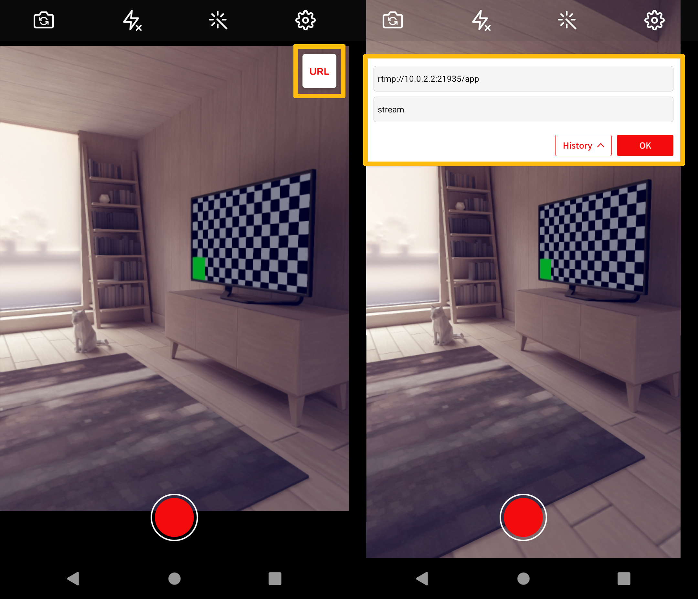

# RTMP

## Configuration

`Providers` ingests streams that come from a media source. OvenMediaEngine supports RTMP protocol. You can set it in the configuration as follows:

```markup
<Server>
    ...
    <Bind>
        <Providers>
            <RTMP>
              <Port>1935</Port>
            </RTMP>
        </Providers>
    </Bind>
    ...
    <VirtualHosts>
        <VirtualHost>
            <Application>
                <Providers>
                    <RTMP>
                    ...
                </RTMP>
                ...
                </Providers>
            <Application>
        </VirtualHost>
    </VirtualHosts>
</Server>
```

When a live source inputs to the `<Application>`, a stream is automatically created in the `<Application>`. The created stream is passed to Encoder and Publisher.

## RTMP live stream

If you set up a live stream using an RTMP-based encoder, you need to set the following in `Server.xml`:

```markup
<Application>
   <Providers>
      <RTMP>
         <BlockDuplicateStreamName>true</BlockDuplicateStreamName>
      </RTMP>
   </Providers>
<Application>
```

* `<BlockDuplicateStreamName>` is a policy for streams that are inputted as overlaps.

`<BlockDuplicateStreamName>` works with the following rules:

| Value | Description                                                                             |
| ----- | --------------------------------------------------------------------------------------- |
| true  | `Default` Rejects the new stream inputted as overlap and maintains the existing stream. |
| false | Accepts a new stream inputted as overlap and disconnects the existing stream.           |


To allow the duplicated stream name feature can cause several problems. When a new stream is an input the player may be disconnected. Most encoders have the ability to automatically reconnect when it is disconnected from the server. As a result, two encoders compete and disconnect each other, which can cause serious problems in playback.


## Publish

If you want to publish the source stream, you need to set the following in the Encoder:

* **`URL`**` ``RTMP://<OvenMediaEngine IP>[:<RTMP Listen Port>]/<App Name]>`
* **`Stream Key`**` ``Stream Name`

If you use the default configuration, the `<RTMP><ListenPort>` is 1935, which is the default port for RTMP. So it can be omitted. Also, since the Application named `app` is created by default in the default configuration, you can enter `app` in the `[App Name]`. You can define a Stream Key and use it in the Encoder, and the Streaming URL will change according to the Stream Key.

Moreover, some encoders can include a stream key in the URL, and if you use these encoders, you need to set it as follows:

* **`URL`**` ``RTMP://<OvenMediaEngine IP>[:<RTMP Listen Port>/<App Name>/<Stream Name>`

### Example with OvenLiveKit (OvenStreamEncoder)

If you are using the default configuration, press the URL button in the top right corner of OvenStreamEnoder, and enter the URL as shown below:



Also, `<App name>` and `<Stream name>` can be changed and used as desired in the configuration.

### Example with OBS

If you use the default configuration, set the OBS as follows:

 (1) (1) (1).png>)

You can set the Stream Key to any name you like at any time.

