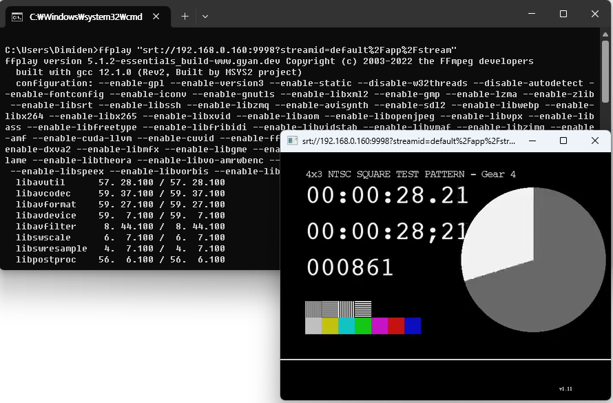

# SRT

OvenMediaEngine supports playback of streams delivered via RTMP, WebRTC, SRT, MPEG-2 TS, and RTSP using SRT-compatible players or integration with other SRT-enabled systems.

Currently, OvenMediaEngine supports H.264, H.265, AAC codecs for SRT playback, ensuring the same compatibility as its [SRT provider functionality](../live-source/srt.md).

## Configuration

### Bind

To configure the port for SRT to listen on, use the following settings:

```xml
<Server>
    <Bind>
        <Publishers>
            <SRT>
                <Port>9998</Port>
                <!-- <WorkerCount>1</WorkerCount> -->
                <!--
                    To configure SRT socket options, you can use the settings shown below.
                    For more information, please refer to the details at the bottom of this document:
                    <Options>
                        <Option>...</Option>
                    </Options>
                -->
            </SRT>
...
```


The SRT Publisher must be configured to use a different port than the one used by the SRT Provider.



### Application

You can control whether to enable SRT playback for each application. To activate this feature, configure the settings as shown below:

```xml
<Server>
    <VirtualHosts>
        <VirtualHost>
            <Applications>
                <Application>
                    <Name>app</Name>
                    <Publishers>
                        <SRT />
...
```

## SRT client and `streamid`

As with using [SRT as a live source](../live-source/srt.md#encoders-and-streamid), multiple streams can be serviced on a single port. To distinguish each stream, you must set the `streamid` option to a value in the format `<virtual host>/<app>/<stream>`.

SRT clients such as FFmpeg, OBS Studio, and `srt-live-transmit` allow you to specify the `streamid` as a query string appended to the SRT URL. For example, you can use a percent-encoded string as the value of `streamid` like this: `srt://host:port?streamid=default%2Fapp%2Fstream`.

> streamid = percent\_encoding("{virtual host name}/{app name}/{stream name}")

## Playback

To ensure that SRT streaming works correctly, you can use tools like FFmpeg or OBS Studio to verify the functionality. Here is the guidance on how to playback the stream using the generated SRT URL.

The SRT URL to be used in the player is structured as follows:

```
srt://<OME Host>:<SRT Publisher Port>?streamid={vhost name}%2F{app name}%2F{stream name}
```

For example, to playback the `default/app/stream` stream from OME listening on port `9998` at `192.168.0.160`, use the following SRT URL:

> `srt://192.168.0.160:9998?streamid=default/app/stream`

You can input the SRT URL as shown above into your SRT client. Below, we provide instructions on how to input the SRT URL for each client.

### FFplay (FFmpeg/FFprobe)

If you want to test SRT with FFplay, FFmpeg, or FFprobe, simply enter the SRT URL next to the command. For example, with FFplay, you can use the following command:

```
$ ffplay "srt://192.168.0.160:9998?streamid=default%2Fapp%2Fstream"
```

<figure><figcaption></figcaption></figure>

### OBS Studio

OBS Studio offers the ability to add an SRT stream as an input source. To use this feature, follow the steps below to add a Media Source:

<figure><figcaption></figcaption></figure>

Once added, you will see the SRT stream as a source, as shown below. This added source can be used just like any other media source.

<figure><figcaption></figcaption></figure>

### VLC

You can also playback the SRT stream in VLC. Simply select `Media` > `Open Network Stream` from the menu and enter the SRT URL.

<figure><figcaption></figcaption></figure>

<figure><figcaption></figcaption></figure>

## SRT Socket Options

You can configure SRT's socket options of the OvenMediaEngine server using `<Options>`. This is particularly useful when setting the encryption for SRT, and you can specify a passphrase by configuring as follows:

```xml
<Server>
    <Bind>
        <Publishers>
            <SRT>
                ...
                <Options>
                    <Option>
                        <Key>SRTO_PBKEYLEN</Key>
                        <Value>16</Value>
                    </Option>
                    <Option>
                        <Key>SRTO_PASSPHRASE</Key>
                        <Value>thisismypassphrase</Value>
                    </Option>
                </Options>
            </SRT>
...
```

For more information on SRT socket options, please refer to [https://github.com/Haivision/srt/blob/master/docs/API/API-socket-options.md#list-of-options](https://github.com/Haivision/srt/blob/master/docs/API/API-socket-options.md#list-of-options).
