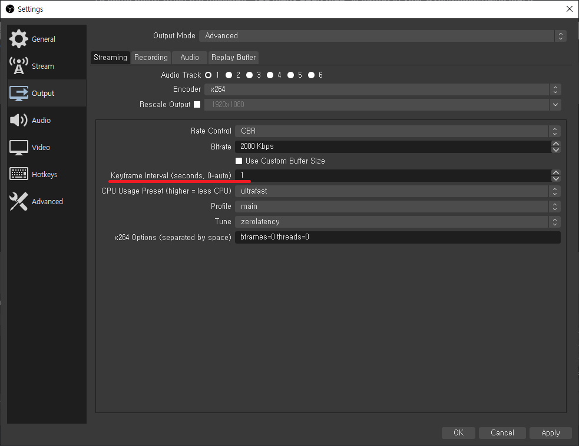

# Troubleshooting

## `prerequisites.sh` Script Failed

If you have problems with the `prerequisites.sh` the script we have provided, please install it manually as follows.

### Platform Specific Installation



```bash
sudo apt install -y build-essential nasm autoconf libtool zlib1g-dev tclsh cmake curl
```



```bash
sudo yum install -y gcc-c++ make nasm autoconf libtool zlib-devel tcl cmake
```



```bash
sudo dnf install -y bc gcc-c++ autoconf libtool tcl bzip2 zlib-devel cmake libuuid-devel
sudo dnf install -y perl-IPC-Cmd perl-FindBin
```



### Common Installation


```bash
PREFIX=/opt/ovenmediaengine && \
OPENSSL_VERSION=1.1.0g && \
DIR=/tmp/openssl && \
mkdir -p ${DIR} && \
cd ${DIR} && \
curl -sLf https://www.openssl.org/source/openssl-${OPENSSL_VERSION}.tar.gz | tar -xz --strip-components=1 && \
./config --prefix="${PREFIX}" --openssldir="${PREFIX}" -Wl,-rpath="${PREFIX}/lib" shared no-idea no-mdc2 no-rc5 no-ec2m no-ecdh no-ecdsa no-async && \
make -j 4 && \
sudo make install_sw && \
rm -rf ${DIR} && \
sudo rm -rf ${PREFIX}/bin
```



```bash
PREFIX=/opt/ovenmediaengine && \
SRTP_VERSION=2.2.0 && \
DIR=/tmp/srtp && \
mkdir -p ${DIR} && \
cd ${DIR} && \
curl -sLf https://github.com/cisco/libsrtp/archive/v${SRTP_VERSION}.tar.gz | tar -xz --strip-components=1 && \
./configure --prefix="${PREFIX}" --enable-shared --disable-static --enable-openssl --with-openssl-dir="${PREFIX}" && \
make shared_library -j 4 && \
sudo make install && \
rm -rf ${DIR}
```



```bash
PREFIX=/opt/ovenmediaengine && \
SRT_VERSION=1.3.3 && \
DIR=/tmp/srt && \
mkdir -p ${DIR} && \
cd ${DIR} && \
curl -sLf https://github.com/Haivision/srt/archive/v${SRT_VERSION}.tar.gz | tar -xz --strip-components=1 && \
PKG_CONFIG_PATH=${PREFIX}/lib/pkgconfig:${PKG_CONFIG_PATH} ./configure --prefix="${PREFIX}" --enable-shared --disable-static && \
make -j 4 && \
sudo make install && \
rm -rf ${DIR} && \
sudo rm -rf ${PREFIX}/bin
```



```bash
PREFIX=/opt/ovenmediaengine && \
OPUS_VERSION=1.1.3 && \
DIR=/tmp/opus && \
mkdir -p ${DIR} && \
cd ${DIR} && \
curl -sLf https://archive.mozilla.org/pub/opus/opus-${OPUS_VERSION}.tar.gz | tar -xz --strip-components=1 && \
autoreconf -fiv && \
./configure --prefix="${PREFIX}" --enable-shared --disable-static && \
make -j 4&& \
sudo make install && \
sudo rm -rf ${PREFIX}/share && \
rm -rf ${DIR}
```



```bash
PREFIX=/opt/ovenmediaengine && \
X264_VERSION=20190513-2245-stable && \
DIR=/tmp/x264 && \
mkdir -p ${DIR} && \
cd ${DIR} && \
curl -sLf https://download.videolan.org/pub/videolan/x264/snapshots/x264-snapshot-${X264_VERSION}.tar.bz2 | tar -jx --strip-components=1 && \
./configure --prefix="${PREFIX}" --enable-shared --enable-pic --disable-cli && \
make -j 4&& \
sudo make install && \
rm -rf ${DIR}
```



```bash
PREFIX=/opt/ovenmediaengine && \
VPX_VERSION=1.7.0 && \
DIR=/tmp/vpx && \
mkdir -p ${DIR} && \
cd ${DIR} && \
curl -sLf https://codeload.github.com/webmproject/libvpx/tar.gz/v${VPX_VERSION} | tar -xz --strip-components=1 && \
./configure --prefix="${PREFIX}" --enable-vp8 --enable-pic --enable-shared --disable-static --disable-vp9 --disable-debug --disable-examples --disable-docs --disable-install-bins && \
make -j 4 && \
sudo make install && \
rm -rf ${DIR}
```



```bash
PREFIX=/opt/ovenmediaengine && \
FDKAAC_VERSION=0.1.5 && \
DIR=/tmp/aac && \
mkdir -p ${DIR} && \
cd ${DIR} && \
curl -sLf https://github.com/mstorsjo/fdk-aac/archive/v${FDKAAC_VERSION}.tar.gz | tar -xz --strip-components=1 && \
autoreconf -fiv && \
./configure --prefix="${PREFIX}" --enable-shared --disable-static --datadir=/tmp/aac && \
make -j 4&& \
sudo make install && \
rm -rf ${DIR}
```



```bash
PREFIX=/opt/ovenmediaengine && \
FFMPEG_VERSION=3.4 && \
DIR=/tmp/ffmpeg && \
mkdir -p ${DIR} && \
cd ${DIR} && \
curl -sLf https://github.com/AirenSoft/FFmpeg/archive/ome/${FFMPEG_VERSION}.tar.gz | tar -xz --strip-components=1 && \
PKG_CONFIG_PATH=${PREFIX}/lib/pkgconfig:${PKG_CONFIG_PATH} ./configure \
--prefix="${PREFIX}" \
--enable-gpl \
--enable-nonfree \
--extra-cflags="-I${PREFIX}/include"  \
--extra-ldflags="-L${PREFIX}/lib -Wl,-rpath,${PREFIX}/lib" \
--extra-libs=-ldl \
--enable-shared \
--disable-static \
--disable-debug \
--disable-doc \
--disable-programs \
--disable-avdevice --disable-dct --disable-dwt --disable-error-resilience --disable-lsp --disable-lzo --disable-rdft --disable-faan --disable-pixelutils \
--disable-everything \
--enable-zlib --enable-libopus --enable-libvpx --enable-libfdk_aac --enable-libx264 \
--enable-encoder=libvpx_vp8,libvpx_vp9,libopus,libfdk_aac,libx264 \
--enable-decoder=aac,aac_latm,aac_fixed,h264 \
--enable-parser=aac,aac_latm,aac_fixed,h264 \
--enable-network --enable-protocol=tcp --enable-protocol=udp --enable-protocol=rtp --enable-demuxer=rtsp \
--enable-filter=asetnsamples,aresample,aformat,channelmap,channelsplit,scale,transpose,fps,settb,asettb && \
make && \
sudo make install && \
sudo rm -rf ${PREFIX}/share && \
rm -rf ${DIR}
```



```bash
PREFIX=/opt/ovenmediaengine && \
JEMALLOC_VERSION=5.2.1 && \
DIR=${TEMP_PATH}/jemalloc && \
mkdir -p ${DIR} && \
cd ${DIR} && \
curl -sLf https://github.com/jemalloc/jemalloc/releases/download/${JEMALLOC_VERSION}/jemalloc-${JEMALLOC_VERSION}.tar.bz2 | tar -jx --strip-components=1 && \
./configure --prefix="${PREFIX}" && \
make && \
sudo make install_include install_lib && \
rm -rf ${DIR}
```


## **`systemctl start ovenmediaengine` failed**

### **Check SELinux**

If SELinux is running on your system, SELinux can deny the execution of OvenMediaEngine.

```bash
# Example of SELinux disallow OvenMediaEngine execution
$ systemctl start ovenmediaengine
==== AUTHENTICATING FOR org.freedesktop.systemd1.manage-units ====
Authentication is required to start 'ovenmediaengine.service'.
Authenticating as: Jeheon Han (getroot)
Password:
==== AUTHENTICATION COMPLETE ====
Failed to start ovenmediaengine.service: Unit ovenmediaengine. service not found.
# Check if SELinux is enabled
$ sestatus
SELinux status:                 enabled
SELinuxfs mount:                /sys/fs/selinux
SELinux root directory:         /etc/selinux
Loaded policy name:             targeted
Current mode:                   enforcing
Mode from config file:          enforcing
Policy MLS status:              enabled
Policy deny_unknown status:     allowed
Memory protection checking:     actual (secure)
Max kernel policy version:      31
# Check if SELinux denies execution
$ sudo tail /var/log/messages
...
May 17 12:44:24 localhost audit[1]: AVC avc:  denied  { read } for  pid=1 comm="systemd" name="ovenmediaengine.service" dev="dm-0" ino=16836708 scontext=system_u:system_r:init_t:s0 tcontext=system_u:object_r:default_t:s0 tclass=file permissive=0
May 17 12:44:24 localhost audit[1]: AVC avc:  denied  { read } for  pid=1 comm="systemd" name="ovenmediaengine.service" dev="dm-0" ino=16836708 scontext=system_u:system_r:init_t:s0 tcontext=system_u:object_r:default_t:s0 tclass=file permissive=0
```

You can choose between two methods of adding a policy to SELinux or setting SELinux to permissive mode. To add a policy, you must apply the SELinux policy file for the OvenMediaEngine service to your system as follows:

```bash
$ cd <OvenMediaEngine Git Clone Root Path>
$ sudo semodule -i misc/ovenmediaengine.pp
$ sudo touch /.autorelabel
# If you add a policy to SELinux, you must reboot the system.
$ sudo reboot
```

Setting SELinux to permissive mode is as simple as follows. But we don't recommend this method.

```bash
$ sudo setenforce 0
```

## **Streaming is not smooth**

### **1.** If you are using Transcoding as Bypass in OvenMediaEngine, and streaming does not work in all players

WebRTC does not support b-frame of H.264. But if your encoder sends b-frames the video will be stuttered in the player. In this case, you can solve the problem by disabling the b-frame function in your encoder. For OBS, you can set bframes=0 option as below.

 (1).png>)

Or by **activating the encoding options** in OvenMediaEngine.


Setting up Transcoding options in OvenMediaEngine: [https://airensoft.gitbook.io/ovenmediaengine/transcoding#encodes](https://airensoft.gitbook.io/ovenmediaengine/transcoding#encodes)


### **2.** When streaming does not work in some players

In this case, you are probably trying to stream with UDP in an environment where packet loss is high due to network performance, connection problems, etc., the interruption during stream playback may more and more worsen. This problem can be solved simply by playing with WebRTC/TCP.

If you want to monitor packet loss in your Chrome browser, you can access it by typing '**chrome://webrtc-internals**' in the address bar.


Setting up WebRTC over TCP in OvenMediaEngine: [https://airensoft.gitbook.io/ovenmediaengine/streaming/webrtc-publishing#webrtc-over-tcp](https://airensoft.gitbook.io/ovenmediaengine/streaming/webrtc-publishing#webrtc-over-tcp)


Also, if the device's network speed, which is running the player, isn't fast enough to accommodate the stream's BPS, the stuttering during streaming won't resolve and will eventually drop the connection. In this case, there is no other way than to speed up your network.

### **3.** When streaming fails due to excessive CPU/Memory/Network usage of Origin in OvenMediaEngine

If the Origin server uses excessive CPU/Memory/Network, all players may experience stuttering during streaming.

When you see Origin is CPU intensive on your Origin-Edge structure, the transcoding options in the OvenMediaEngine may be the primary cause. That is, you may have set the quality of the input stream too high, or the output stream to exceed the capabilities of your hardware significantly. In this case, it can be solved by **enabling the hardware encoder** in OvenMediaEngine.


Setting up GPU Acceleration in OvenMediaEngine: [https://airensoft.gitbook.io/ovenmediaengine/transcoding/gpu-usage](https://airensoft.gitbook.io/ovenmediaengine/transcoding/gpu-usage)


### **4.** When streaming fails due to excessive CPU/Memory/Network usage of Edge in OvenMediaEngine

If the edge server excessively uses CPU/Memory/Network, the player connected to that Edge may experience stuttering during streaming. In this case, it can be solved by **expanding Edge**.

### **5. If** you have enough CPU/Memory/Network, but streaming is not smooth

#### 5-1. When a specific thread is using the CPU excessively

When you see a specific thread overuses the CPU, the video may not stream smoothly. Please refer to the manual below for more information on this.


Tuning OvenMediaEngine Performance: [https://airensoft.gitbook.io/ovenmediaengine/performance-tuning#performance-tuning](https://airensoft.gitbook.io/ovenmediaengine/performance-tuning#performance-tuning)


#### 5-2. Tuning your Linux kernel

The Linux kernel, which is set by default, **cannot handle 1Gbps output**, so put it as follows:

```
[ec2-user@ip-172-31-56-213 ~]$ cat /etc/sysctl.conf
fs.file-max = 100000
net.core.somaxconn = 65535
net.ipv4.tcp_max_tw_buckets = 1440000
net.ipv4.ip_local_port_range = 1024 65000
net.ipv4.tcp_fin_timeout = 15
net.ipv4.tcp_window_scaling = 1
net.ipv4.tcp_max_syn_backlog = 324000
net.core.rmem_max = 16777216
net.core.wmem_max = 16777216
net.core.rmem_default = 16777216
net.core.wmem_default = 16777216
net.core.optmem_max = 40960
net.ipv4.tcp_rmem = 4096 87380 16777216
net.ipv4.tcp_wmem = 4096 65536 16777216
net.core.netdev_max_backlog = 50000
net.ipv4.tcp_max_tw_buckets = 2000000
net.ipv4.tcp_tw_reuse = 1
net.ipv4.tcp_fin_timeout = 10
net.ipv4.tcp_slow_start_after_idle = 0

[ec2-user@ip-172-31-56-213 ~]$ cat /etc/security/limits.conf
* soft nofile 1048576
* hard nofile 1048576
```

#### 5-3. Congestion Control: Change to BBR

The mobile environment used by many people uses a **wireless network**. It has a high network speed but, conversely, can cause high packet loss.

Look, **CUBIC**, the Congestion Control set by default in your Linux, adjusts the TCP Window by packet loss, so it is not suitable to provide stable streaming in such an environment.


So our suggestion is to use Google's **BBR**. This setting is even more important if you mainly provide WebRTC services to mobile users who use a wireless network. Change the Congestion Control from CUBIC to BBR on your Linux.

## Player connection fails

### **1. Due to the** Mixed Contents

If you try to access OvenMediaEngine's WebRTC URL starting with **ws://** _(Non-TLS)_ from an **HTTPS** _(HTTP/TLS)_ site, the connection may be rejected due to a mixed content problem depending on the browser.

In this case, you can solve this by installing a certificate in OvenMediaEngine and trying to connect with the **wss://** _(WebSocket/TLS)_ URL.


Setting up TLS Encryption in OvenMediaEngine: [https://airensoft.gitbook.io/ovenmediaengine/streaming/tls-encryption](https://airensoft.gitbook.io/ovenmediaengine/streaming/tls-encryption)


### **2.** Due to a Cross-Origin Resource Sharing (CORS) Error

As of October 2021, most browsers have enforced the [CORS policy](https://fetch.spec.whatwg.org), and CORS errors often occur when requesting access to other domains if it is not a TLS site. In this case, you can solve the problem by **installing a certificate** on the site that loads the player.

### **3.** When the message "Too many open files" appears in the log, the player cannot connect

At some point, when the message "**Too many open files**" is output in your OvenMediaEngine log, it may not be able to handle any more player connections. In this case, you can solve the problem by setting it as follows:

```
[ec2-user@ip-172-31-56-213 ~]$ cat /etc/security/limits.conf
* soft nofile 1048576
* hard nofile 1048576
```

## Player takes a long time first to load while trying to stream

### 1. Due to the Keyframe Interval

If you use Transcoding as Bypass in OvenMediaEngine and set a **long keyframe interval** in the encoder, the WebRTC player cannot start streaming until a keyframe is an input.

In this case, you can solve this by setting the keyframe interval in the encoder to **1-2 seconds**,

<figure><figcaption><p>How to set the keyframe intverval in OBS, which is the most used encoder</p></figcaption></figure>

Or by **enabling the encoding options** in OvenMediaEngine.


Setting up Transcoding options in OvenMediaEngine: [https://airensoft.gitbook.io/ovenmediaengine/transcoding#encodes](https://airensoft.gitbook.io/ovenmediaengine/transcoding#encodes)


## A/V is out of sync

### 1. When the A/V sync does not match during initial streaming, and it gradually fits

A/V may not be input evenly from the encoder. There are some encoders with policies for reliable streaming that they decide, for example, sending audio first and video very later, or video first and audio very late.

OvenMediaEngine outputs the input received from the encoder as-is for sub-second latency streaming. The WebRTC player also streams the received input as-is, so the A/V sync may not match during the initial playback due to the policy of specific encoders.

However, this can be resolved naturally as the player will sync A/V while streaming based on Timestamp. Still, if this work looks like an error, you can also solve it by **enabling JitterBuffer** in OvenMediaEngine.

Also, suppose you are using a transcoder in OvenMediaEngine and trying to input with b-frames of H264. Audio is encoded fast, but a video is buffered at the decoder because of b-frames. Therefore, there is a time difference at the start of each encoding, which may cause the A/V to be out of sync. Even in this case, **enabling JitterBuffer** will solve this problem.


Setting up WebRTC JitterBuffer in OvenMediaEngine: [https://airensoft.gitbook.io/ovenmediaengine/streaming/webrtc-publishing#publisher](https://airensoft.gitbook.io/ovenmediaengine/streaming/webrtc-publishing#publisher)


### 2. Time has passed, but A/V is out of sync

There may be cases where the A/V sync is not corrected even after a certain amount of time has elapsed after playback. This problem is caused by **small internal buffers** in some browsers such as Firefox, which causes the player to give up calibration if the A/V sync differs too much. But this can also be solved by **enabling JitterBuffer**.


Setting up WebRTC JitterBuffer in OvenMediaEngine: [https://airensoft.gitbook.io/ovenmediaengine/streaming/webrtc-publishing#publisher](https://airensoft.gitbook.io/ovenmediaengine/streaming/webrtc-publishing#publisher)


Nevertheless, if the A/V sync is not corrected, you should suspect an error in the original video file, which can be checked by playing as HLS.

However, if A/V sync is well during streaming with HLS, this is OvenMediaEnigne's bug. If you find any bugs, please feel free to report them to [**OvenMediaEngine GitHub Issues**](https://github.com/AirenSoft/OvenMediaEngine/issues).

## No audio is output

### 1. When Opus is not set in the encoding options

WebRTC supports Opus, not AAC, as an audio codec. Because RTMP and other protocols mainly use and transmit AAC as the audio codec, you may not have set up Opus, but WebRTC cannot output audio without Opus. This can be solved by **setting Opus** in OvenMediaEnigne.


Setting up Opus Codec in OvenMediaEngine: [https://airensoft.gitbook.io/ovenmediaengine/transcoding#audio](https://airensoft.gitbook.io/ovenmediaengine/transcoding#audio)


## Not the video quality you want

### 1. When video encoding is enabled in OvenMediaEngine

If you are using video encoding in OME, the video bitrate may be set low. In this case, the video quality can be improved by **increasing the unit of video bitrate**.

However, since OvenMediaEngine has the default to the fastest encoding option for sub-second latency streaming, the video quality may not be as good as the set video bitrate. In this case, OvenMediaEngine provides an **output profile preset** that can control the quality, so you can choose to solve it.


Choosing an Encoding Preset in OvenMediaEngine: [https://airensoft.gitbook.io/ovenmediaengine/transcoding#video](https://airensoft.gitbook.io/ovenmediaengine/transcoding#video)


### 2. If you are using Transcoding as Bypass in OvenMediaEngine

Since the encoder is transmitting video to OvenMediaEngine in low quality, you can solve it by increasing the input quality in the encoder settings.
