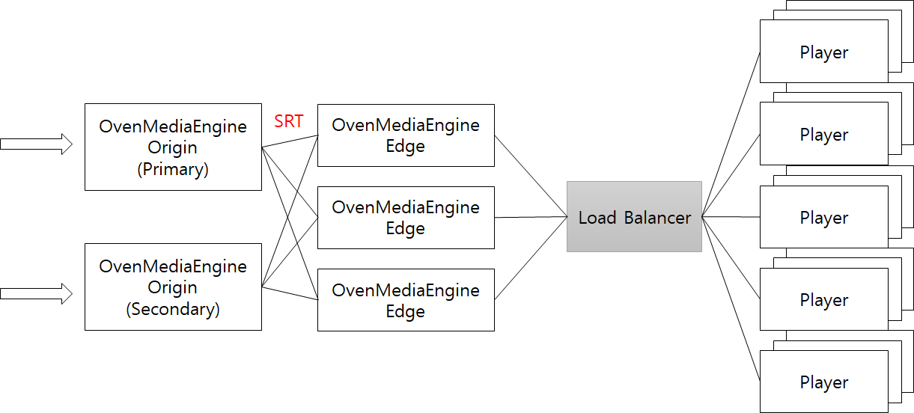

# Clustering

OvenMediaEngine \(OME\) supports Clustering and ensures High Availability \(HA\) and Scalability.



OME supports the Origin-Edge structure for configuring Cluster and provides Scalability. Also, you can set Origin as `Primary` and `Secondary` in OME for HA.

## Origin-Edge Configuration

Origin and Edge synchronize the `<Application>`. Moreover, Origin can connect with hundreds of Edge.

When delivering media data from Origin to Edge, we used the SRT protocol to reduce latency and improve reliability. For more information on the SRT Protocol, please visit the [SRT Alliance](https://www.srtalliance.org/) site.

### Origin Application

The role of the Origin Application is to transcode the inputted Live source and transmit it to the Edge. Origin works as `live` that sets in `<Type>` in `<Application>` just like Single Mode, and Edge connects to the port that sets in `<ListenPort>` element in `<Origin>`.

You can operate Origin with the following settings:

```markup
<?xml version="1.0" encoding="UTF-8"?>
<Server version="1">
   <Name>OvenMediaEngine</Name>
   <Hosts>
      <Host>
         <Name>default</Name>
         <IP>*</IP>
         <Applications>
            <Application>
               <Name>app</Name>
               <Type>live</Type>
               <Origin>
                  <ListenPort>9000</ListenPort>
               </Origin>
               <Encodes>
                  ...
               </Encodes>
               <Streams>
                  ...
               </Streams>
               <Providers>
                  ...
               </Providers>
               <Publishers>
                  ...
               </Publishers>
            </Application>
         </Applications>
      </Host>
   </Hosts>
</Server>
```

### Edge Application

The role of the Edge Application is to receive the transcoded stream from Origin and repeat it. Also, you can configure hundreds of Edge to distribute the traffic that the Player receives.

As a result of our testing, one Edge can process 4 to 5Gbps traffic based on [AWS C5.2XLarge](https://aws.amazon.com/ko/ec2/instance-types/c5/). If you need to handle more traffic, you can configure and use multiple Edge.

When you set the `<Application><Type>` element to `liveedge` and fill the Origin `<IP>` and `<Port>` in `<Origin><Primary>`, It synchronizes with the Application with the same name as the Origin server.

### High-Availability

If you set `<Origin><Secondary>` element, OME automatically switches to `<Secondary>` Origin when there is a problem with the `<Primary>` Origin.

You need to configure `<Primary>` and `<Secondary>` Origin in `<Application>` on the same stream to use this function. 

```markup
<?xml version="1.0" encoding="UTF-8"?>

<Server version="1">
	<Name>OvenMediaEngine</Name>
	<Hosts>
		<Host>
			<Name>default</Name>
			<IP>*</IP>
			<Applications>
				<Application>
					<Name>app</Name>
					<Type>liveedge</Type>
					<Origin>
						<Primary>192.168.0.183:9000</Primary>
						<Secondary>192.168.0.183:9000</Secondary>
					</Origin>
					<Publishers>
						<ThreadCount>2</ThreadCount>
						<HLS/>
						<DASH/>
						<WebRTC>
		                     <IceCandidate>*:10000-10005/udp</IceCandidate>
		                     <Timeout>30000</Timeout>		
		                     <Signalling>
		                        <ListenPort>3333</ListenPort>
		                     </Signalling>
		                  </WebRTC>
					</Publishers>
				</Application>
			</Applications>
		</Host>
	</Hosts>
</Server>
```

 

## Load Balancer

When you are configuring Load Balancer, you need to use third-party solutions such as L4 Switch, LVS, or GSLB, but we recommend using DNS Round Robin. Also, services such as cloud-based [AWS Route53](https://aws.amazon.com/ko/route53/), [Azure DNS](https://azure.microsoft.com/ko-kr/services/dns/), or Google Cloud DNS can be a good alternative.

